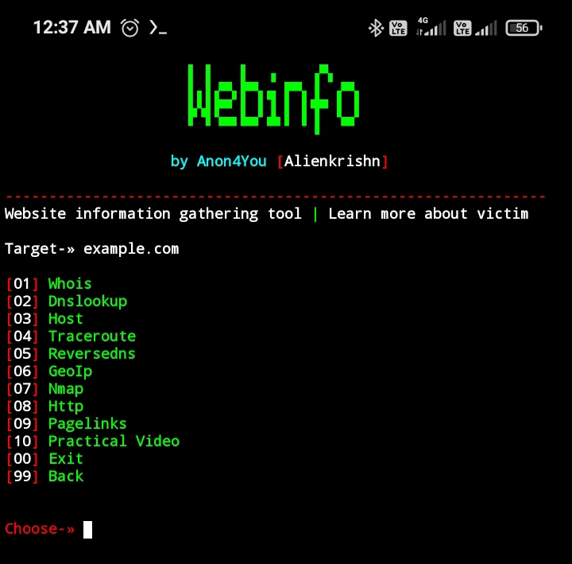

[](https://github.com/Anon4You/webinfo/blob/main/LICENSE)

# webinfo v1
>A website information gathering tool for termux
## Menu
|whois
|dnslookup
|host
|traceroure
|reversedns
|geoip
|nmap
|httpheaders
|pagelinks

## Installation
> Just copy and paste the bellow command in your Termux... 
```
pkg up && pkg install wget -y && wget https://raw.githubusercontent.com/Anon4You/webinfo/main/webinfo.sh && chmod +x webinfo.sh && ./webinfo.sh
```
## Author
* [Alienkrishn](https://www.instagram.com/alienkrishn) - webinfo


